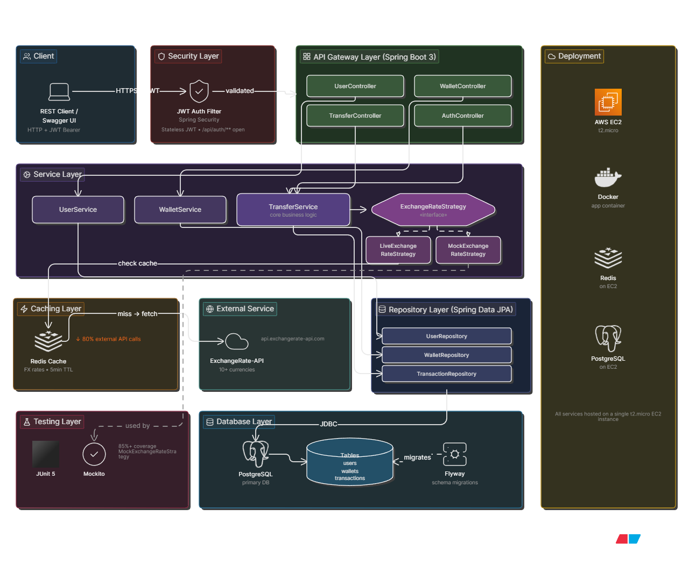

## 🏦💰 Multi-Currency Banking API 💰🏦

[](https://www.oracle.com/java/technologies/javase/jdk17-archive-downloads.html)
[](https://spring.io/projects/spring-boot)
[](https://www.postgresql.org/)
[](https://redis.io/)
[](https://www.docker.com/)
[](https://aws.amazon.com/ec2/)

A production-style REST API built with **Java 17 + Spring Boot 3** that enables cross-border fund transfers with live exchange rate conversion, simulating real-world fintech backend systems.
---
- Live Demo: [Swagger API Docs](http://43.204.227.166:8080/swagger-ui/index.html)
## Problem Statement

Traditional banking APIs treat money as a single-currency value. In reality:

- Users hold **wallets in multiple currencies**
- Transfers happen **across borders**
- Exchange rate snapshots must be **auditable and immutable**

This API solves that by supporting **multi-wallet users + real-time currency conversion + immutable transaction logs**.

---

## Architecture



### Layer Breakdown

| Layer | Technology | Responsibility |
|-------|-----------|--------------|
| **Client** | REST Client / Swagger UI | HTTP requests + JWT Bearer tokens |
| **Security** | Spring Security + JWT Filter | Stateless authentication; `/api/auth/**` open |
| **API Gateway** | Spring Boot 3 Controllers | HTTP handling, request validation, routing |
| **Service** | Spring Services + Strategy Pattern | Business logic, FX conversion, caching checks |
| **Caching** | Redis | FX rates cached with 5-minute TTL; **80% reduction** in external API calls |
| **External** | ExchangeRate-API | Live FX rates for 10+ currencies |
| **Repository** | Spring Data JPA | Data access abstraction |
| **Database** | PostgreSQL + Flyway | Primary persistent storage with versioned schema migrations |
| **Testing** | JUnit 5 + Mockito | 85%+ coverage including mocked external API failures |
| **Deployment** | Docker + AWS EC2 (t2.micro) | Containerized monolith on single EC2 instance |

### Design Patterns Used

- **Strategy Pattern:** `ExchangeRateStrategy` interface with `LiveExchangeRateStrategy` and `MockExchangeRateStrategy` implementations. Swap FX sources without touching business logic.
- **Factory Pattern:** Wallet creation logic abstracted from controllers.
- **Repository Pattern:** Clean separation: Controller → Service → Repository. Each layer has a single responsibility.

---

## Features

- **Multi-Wallet Users:** Create users with multiple currency wallets (USD, EUR, INR, etc.)
- **Cross-Border Transfers:** Transfer between wallets with real-time FX conversion
- **Immutable Transaction Logs:** Every conversion is recorded with the snapshot exchange rate
- **JWT Authentication:** Stateless Bearer token security on all endpoints
- **Idempotency Keys:** Duplicate transaction prevention via `Idempotency-Key` header
- **Redis Caching:** FX rates cached for 5 minutes, reducing external API dependency by ~80%
- **Schema Versioning:** Flyway-managed PostgreSQL migrations
- **Comprehensive Testing:** 85%+ coverage with unit and integration tests
- **Auto-Generated Docs:** SpringDoc OpenAPI at `/swagger-ui.html`

---

## Tech Stack

| Technology | Purpose |
|-----------|---------|
| Java 17 | Core language |
| Spring Boot 3 | REST framework |
| Spring Security + JWT | Stateless authentication & authorization |
| Spring Data JPA | Data access layer |
| PostgreSQL 15 | Primary relational database |
| Flyway | Database schema versioning & migrations |
| Redis 7 | Exchange rate caching with TTL |
| JUnit 5 + Mockito | Unit & integration testing |
| Docker | Containerization |
| AWS EC2 (t2.micro) | Cloud deployment |
| SpringDoc OpenAPI | Auto-generated API documentation |
| ExchangeRate-API | Live foreign exchange rate data |

---

## API Endpoints

### Authentication
| Method | Endpoint | Description | Auth |
|--------|----------|-------------|------|
| `POST` | `/api/auth/register` | Register new user | Public |
| `POST` | `/api/auth/login` | Login, returns JWT | Public |
| `GET` | `/api/auth/me` | Get current user | Bearer JWT |

### Users
| Method | Endpoint | Description | Auth |
|--------|----------|-------------|------|
| `POST` | `/api/users` | Create user | Bearer JWT |
| `GET` | `/api/users/{id}` | Get user by ID | Bearer JWT |
| `GET` | `/api/users` | List all users | Bearer JWT |

### Wallets
| Method | Endpoint | Description | Auth |
|--------|----------|-------------|------|
| `POST` | `/api/wallets` | Create wallet | Bearer JWT |
| `GET` | `/api/wallets/user/{userId}` | Get user's wallets | Bearer JWT |
| `GET` | `/api/wallets/{walletId}` | Get wallet by ID | Bearer JWT |
| `POST` | `/api/wallets/{walletId}/deposit` | Deposit funds | Bearer JWT |

### Transfers
| Method | Endpoint | Description | Auth |
|--------|----------|-------------|------|
| `POST` | `/api/transfers` | Cross-currency transfer (requires `Idempotency-Key` header) | Bearer JWT |
| `GET` | `/api/transfers/history/{walletId}` | Transaction history | Bearer JWT |

### Health & Docs
| Method | Endpoint | Description | Auth |
|--------|----------|-------------|------|
| `GET` | `/actuator/health` | Service health check | Public |
| `GET` | `/swagger-ui.html` | Interactive API documentation | Public |

---

## Security

- **JWT Authentication:** Stateless Bearer tokens via Spring Security. Tokens expire after 24 hours.
- **BCrypt Encoding:** Passwords hashed with BCrypt before storage.
- **Idempotency:** `Idempotency-Key` header on transfer requests prevents duplicate transactions under network retries.
- **Input Validation:** Bean Validation (`@Valid`) on all request DTOs.
- **Global Exception Handling:** `@ControllerAdvice` returns consistent error JSON with structured error codes.

---

## Quick Start

### Prerequisites
- Java 17+
- Maven 3.8+
- Docker & Docker Compose
- (Optional) PostgreSQL and Redis running locally


**Coverage:** 85%+ line coverage across service and controller layers, including mocked external API failures and Redis cache miss scenarios.

---

## Deployment

### AWS EC2 (Current)
- **Instance:** t2.micro (Free Tier eligible)
- **Services:** Single EC2 hosts Docker containers for App, PostgreSQL, and Redis
- **Next Steps:** RDS for managed PostgreSQL, ElastiCache for Redis, ALB for load balancing

### Docker Build
```bash
docker build -t multi-currency-api .
docker run -p 8080:8080 --env-file .env multi-currency-api
```

---

## Roadmap

- [ ] Separate RDS and ElastiCache from application EC2
- [ ] Implement rate limiting (Bucket4j or Redis-based)
- [ ] Add CI/CD pipeline with GitHub Actions
- [ ] Implement API versioning (`/api/v1/`)
- [ ] Structured JSON logging with correlation IDs

---

## License

MIT License — feel free to use this as a reference for your own projects.

---

**Built by [Pranav BJ](https://github.com/PranavBj2406) | [LinkedIn](https://linkedin.com/in/pranav-bj)**
